# DI-Carthage-tutorial
Так как же создаются новые модуля для проекта с учетом зависимостей Carthage?
Постараюсь изложить все по шагам.
Для начала создаем проект -> Cocoa Touch Framework:
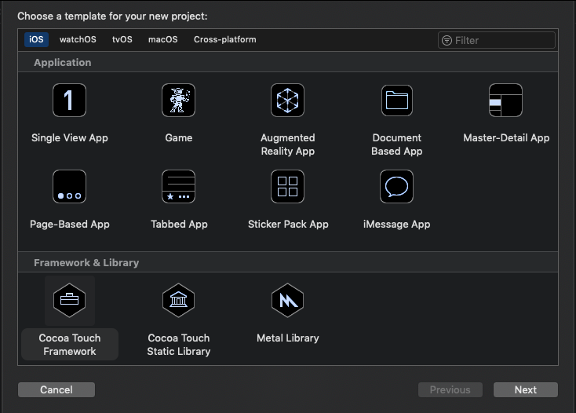
Даем ему имя:
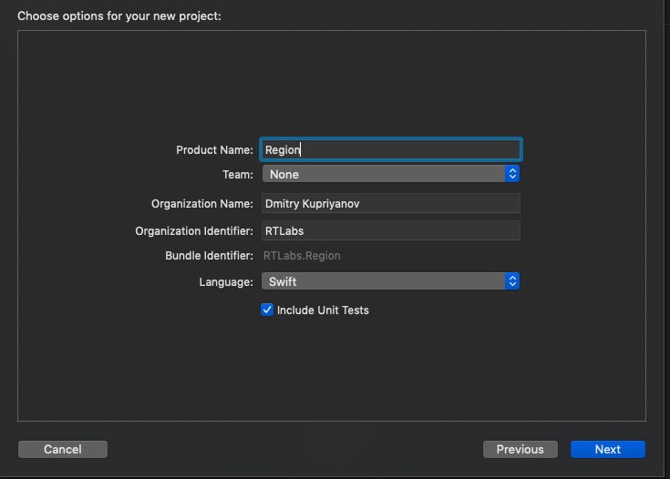
И сохраняем его в нужную папку(В случае обычного модуля - Gosweb Platform/Modules, а в случае API для модуля -> Gosweb Platform/API)
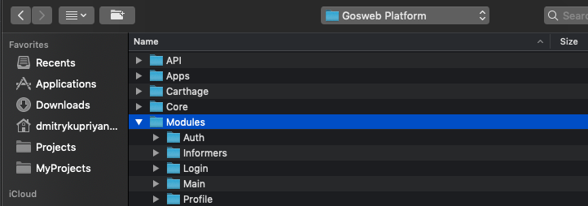

Дальше надо добавить 3rd party библиотеки, которые будут использоваться модулем.
Делаем это на вкладке General, в меню таргета.
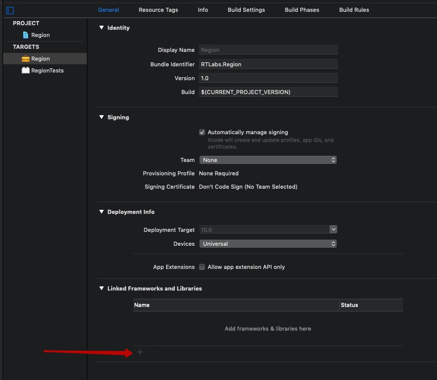
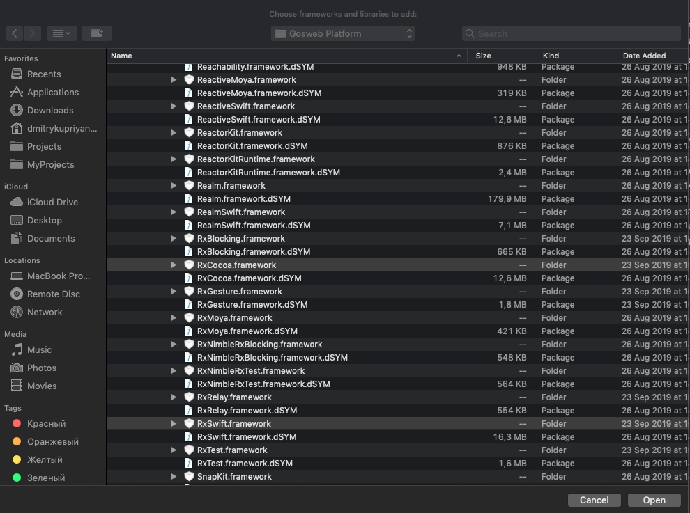
Проверяем, что путь у нас прописан не жестко(ссылка на файл должна быть относительной)
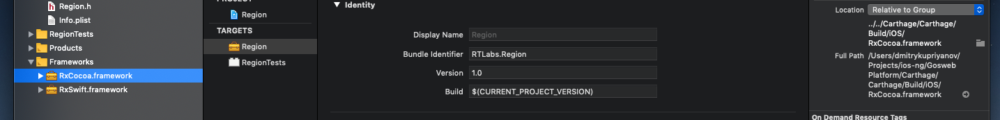

На этом моменте проект фреймворка у нас собираться не должен и будет выдавать ошибку, что фреймворк не найден.

Чтобы это починить переходим во вкладку "Build settings" и ищем раздел "Search paths", а в нем параметр "Framework Search Paths". В туда указываем опять же относительный путь до папки с фреймворками.

"$(PROJECT_DIR)/../../Carthage/Carthage/Build/iOS/"
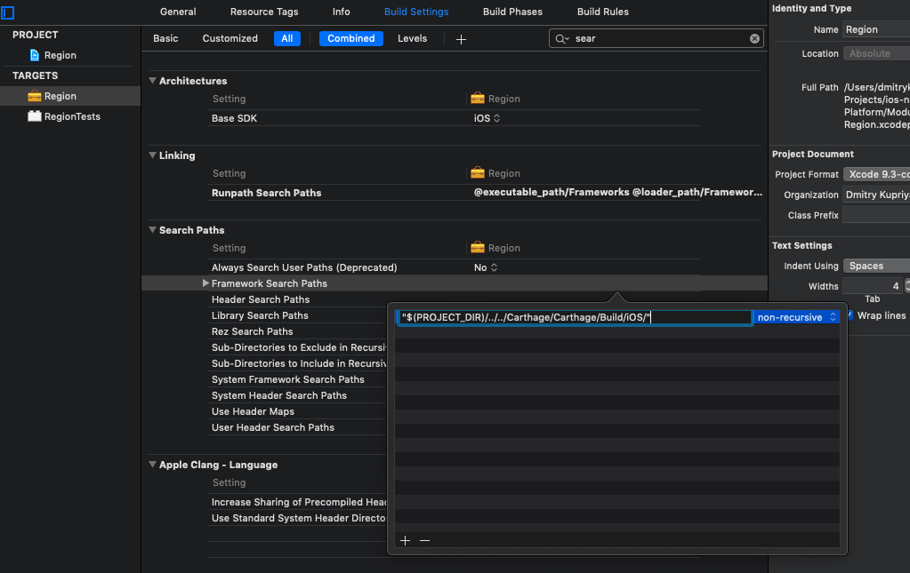

В таргете с тестом делаем тоже самое.

После этого проект фрейморка должен спокойно билдится.

Далее в таргете с тестом во вкладке "Build Phases" в пункт "Link Binary With Libraries" перетаскиваем бинарники из Project Navigator слева.

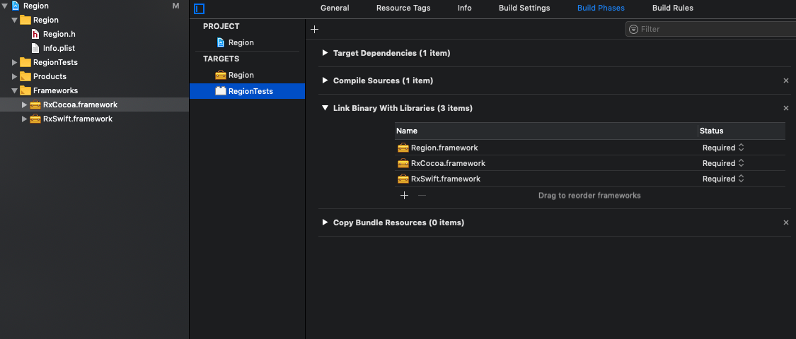

Далее создаем по плюсику "New Copy Files Phase", меняем Destanation на Frameworks и переносим наши фреймворки и убираем галочки.
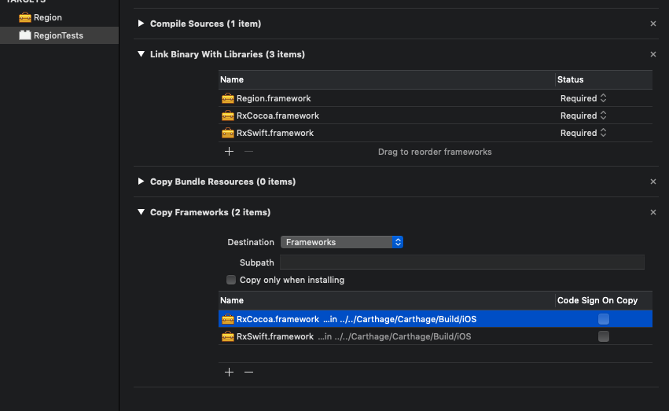

После этого прокет должен проходить тест(CMD+U). Если библиотеки с собой что-то тянут, то в консоли должно появиться сообщение, какой либы не хватает.

Добавляем ее в таргет теста через плюсик. И не забываем продублировать ее в Copy Frameworks.

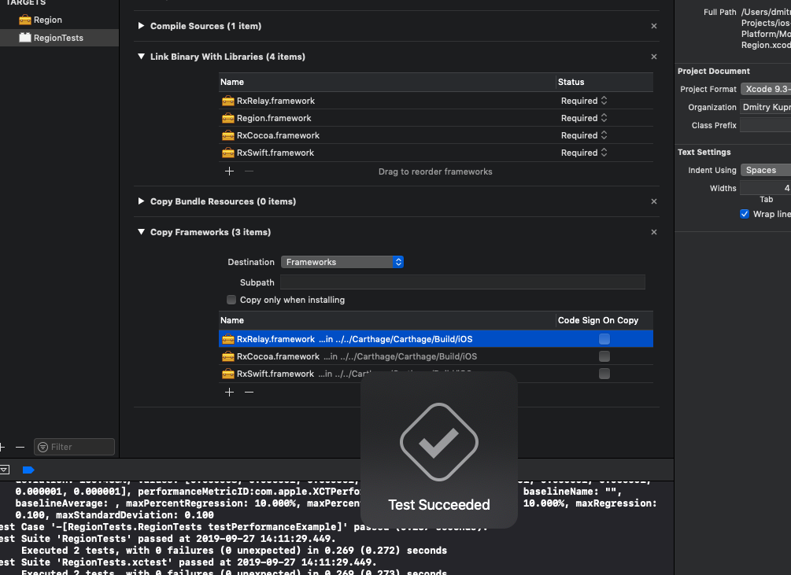

Следующий момент в том, что если наш модуль будет использовать другие модули ему надо подсунуть зависимости от них.

Далее в этом же проекте создаем New Group without Folder.

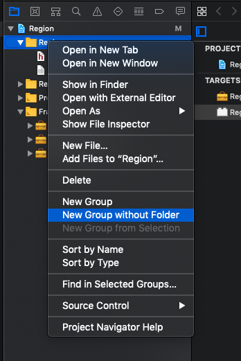

Называем ее Dependencies
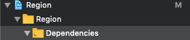

Дальше закрываем прокт модуля и открываем основной проект.

Создаем папку без физ.папки в папке Features + API

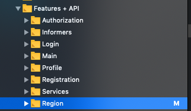

Если в нашем модуле нам нужны зависимости от Core модулей или API необходимо сделать следующее:

В Папку Dependencies перетащить нужный модуль(синенький значок). Спросит - ответить cоздать Reference без копирвоания.

После этого надо сначала указать зависимость в Target Dependencies
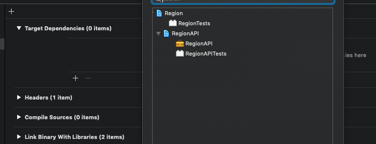

И не забыть добавть модуль во вкладке General -> Linked Frameworks and Librares
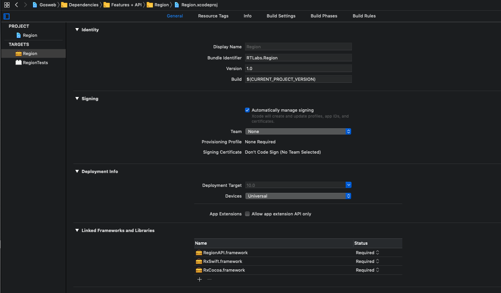

Ну и придерживаясь этих правил можно дальше работать с проектом.

